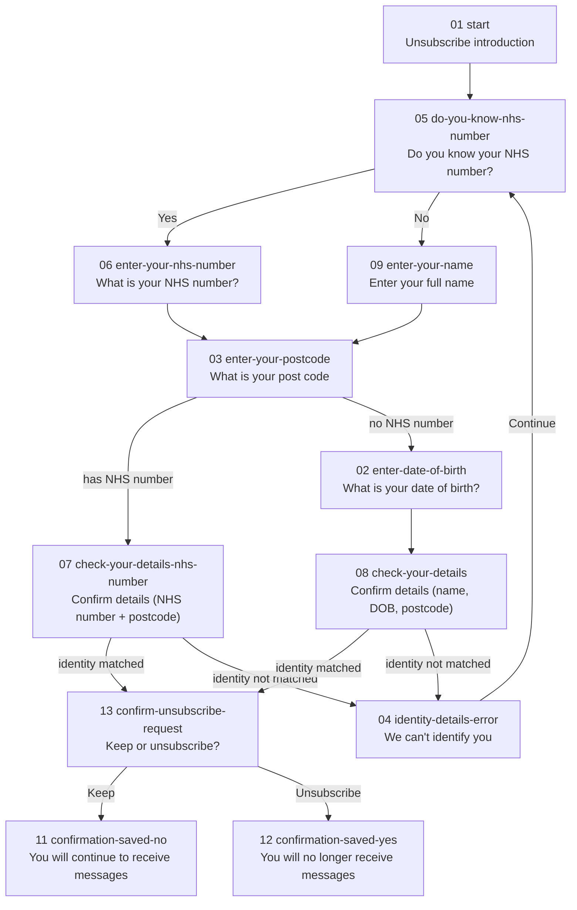

# NHS website opt-out journey — flow diagram

Non-app, standard NHS website version of the age-based messages opt-out flow.
Routes live under `/website/pages/opt-out/`, views in
`app/views/website/pages/opt-out/`, and POST handlers in `app/routes.js`.

## Notes

- The postcode step is shared by both identity paths (NHS number, or
  name + date of birth).
- The identity check is simulated in `app/routes.js`: enter postcode
  `SW1 2CV` to pass verification on either path; anything else routes to
  the `identity-details-error` page, whose Continue button loops back to
  `do-you-know-nhs-number` to retry.
- Both confirmation pages (`confirmation-saved-yes` / `confirmation-saved-no`)
  use the standard `nhsuk-frontend` panel component, not app-specific styling.
